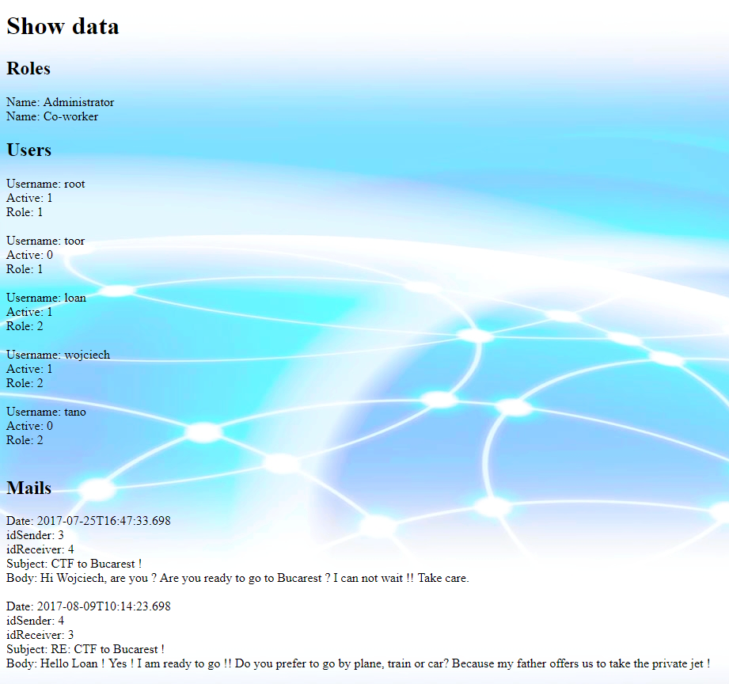
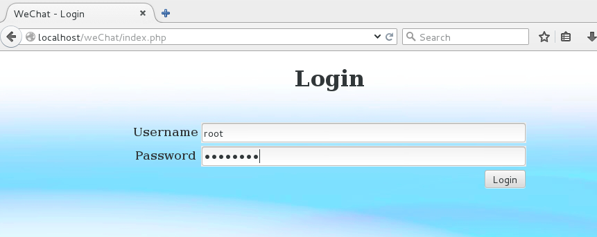
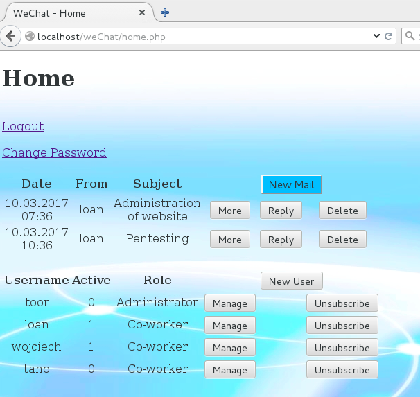
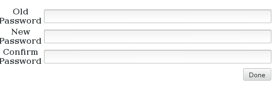
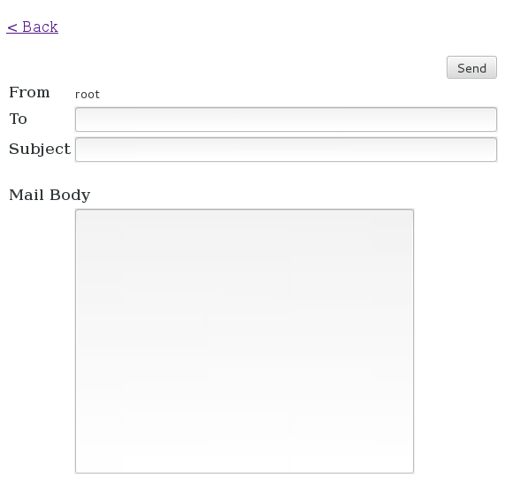
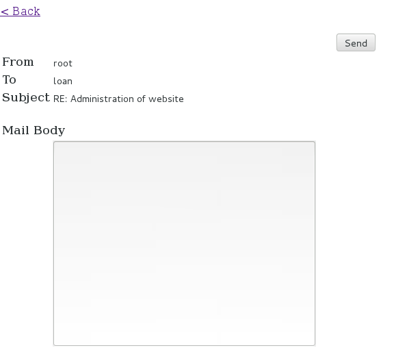
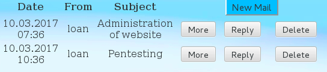
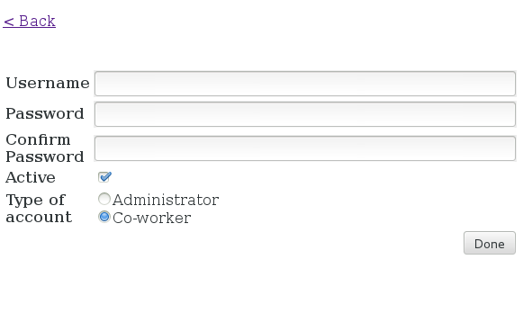
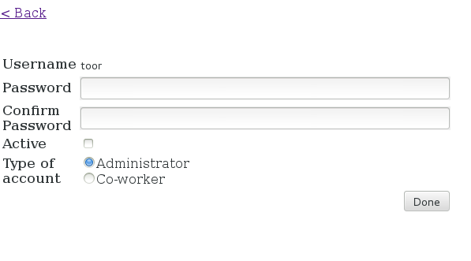
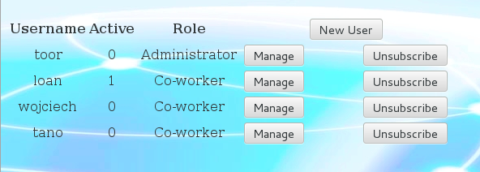

# WeChat :: A STI Project
Authors: Loan Lassalle & Wojcieh Myszkorowski
***

## Introduction

The purpose of this repo is to design a Web application, within the framework of a company, to send text messages between collaborators.

**Constraints**

- Use PHP
- Use SQLite (possibly MySQL)
- If other libraries or technologies are to be used, they must be validated by the teacher
- The whole application will have to work on the provided virtual machine (CentOS)

## Installation

* Get the script file `run.sh` and run it

`$ wget -O "~/Downloads/run.sh" "https://raw.githubusercontent.com/lassalleloan/WeChat/master/run.sh" && sh "~/Downloads/run.sh"`

The database has been successfully initialized. It is now possible to use the web application.

  

## Access to the web application

* Enter in your Internet browser the following address: http://localhost/wechat/home.php

  

* Enter a username and a password to access the home page of the Web application.
Several users are already present in the database:

 |      Username     |   Password   | Active|  Administrator |
 |:-----------------:|:------------:|:-----:|:--------------:|
 |        root       |   toortoor   |  yes  |       yes      |
 |        toor       |   rootroot   |  no   |       yes      |
 |        loan       |   12341234   |  yes  |       no       |
 |      wojciech     |   45674567   |  yes  |       no       |
 |        tano       |   78907890   |  no   |       no       |

* Several actions are available when connected to the web application.

  

## Available actions

* To change the password
It is necessary to enter the old password and the new one twice.

  

   
* Send a new email
It is necessary to enter the exact name of the recipient, a subject and a content for the email.

  

   
* Reply to an email
The email contains the sender, the recipient and the subject of the email to be answered.
Just enter the main content of the email and press the send button.

  

   
* Delete an email
Pressing the button will delete the selected email.

  

The following operations are available only for administrator accounts:

* Create a new user
It is necessary to enter a username, a password and its confirmation and the type of account, Administrator or not.

  

* Manage a user
It is possible to change the password and/or account type of a user.

  

* Delete a user
Pressing the button will delete the selected user.

  

