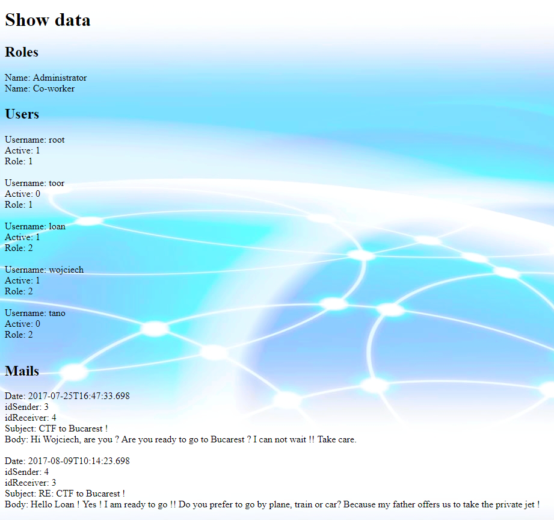
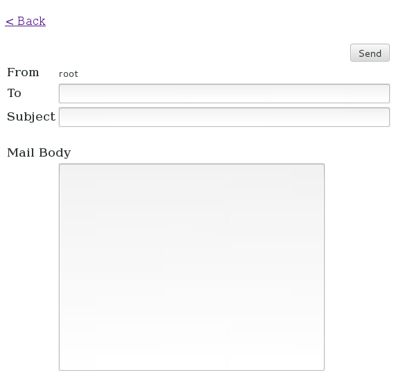
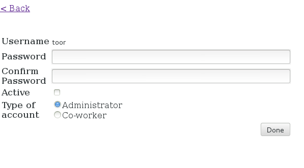

# WeChat :: A STI Project
Authors: Loan Lassalle & Wojcieh Myszkorowski
***

## Introduction

Le but de ce repo est de concevoir une application Web permettant, dans le cadre d’une entreprise, d’envoyer des messages de texte entre les collaborateurs.

**Contraintes**
- Utiliser PHP
- Utiliser SQLite (éventuellement MySQL)
- Si d’autres librairies ou technologies doivent être utilisées, elles doivent être validées par le professeur
- L’ensemble de l’application devra fonctionner sur la machine virtuelle fournie (CentOS)

## Installation

* Récupérer l'archive de l'application Web à [cette adresse](https://github.com/lassalleloan/WeChat/archive/master.zip "Archive ZIP").

`$ wget -O ~/Downloads/weChat.zip "https://github.com/lassalleloan/WeChat/archive/master.zip"`

* Dézipper l'archive dans le dossier `/var/www/html/`

`$ unzip ~/Downloads/weChat.zip -d /var/www/html/`

* Changer le groupe propriétaire du dossier `/var/www/html/WeChat-master`

`$ sudo chgrp -R apache /var/www/html/WeChat-master`

* Démarrer le service httpd

`$ sudo systemctl start httpd`

* Saisir dans votre navigateur Internet l'adresse suivante : http://localhost/WeChat-master/init.php

La base de données à été correctement initialisée. Il est maintenant possible d'utiliser l'application Web.

  

## Accès à l'application Web

* Saisir dans votre navigateur Internet l'adresse suivante : http://localhost/WeChat-master/home.php

  

* Saisir un nom d'utilisateur et mot de passe afin d'accéder à la page d'acceuil de l'application Web.
Plusieurs utilisateurs sont déjà présents dans la base de données :

   <table>
      <thead>
         <tr>
            <th>Nom d'utilisateur</th>
            <th>Mot de passe</th>
            <th>Actif</th>
            <th>Administrateur</th>
         </tr>
      </thead>
      <tbody>
         <tr>
            <td>root</td>
            <td>toortoor</td>
            <td>oui</td>
            <td>oui</td>
         </tr>
         <tr>
            <td>toor</td>
            <td>rootroot</td>
            <td>non</td>
            <td>oui</td>
         </tr>
         <tr>
            <td>loan</td>
            <td>12341234</td>
            <td>oui</td>
            <td>non</td>
         </tr>
         <tr>
            <td>wojciech</td>
            <td>45674567</td>
            <td>oui</td>
            <td>non</td>
         </tr>
         <tr>
            <td>tano</td>
            <td>78907890</td>
            <td>non</td>
            <td>non</td>
         </tr>
      </tbody>
   </table>

* Plusieurs actions sont à votre disposition une fois connecté à l'application Web.

  

## Actions disponibles

* Changer le mot de passe
Il est nécessaire de saisir l’ancien mot de passe et deux fois le nouveau.

  

   
* Envoyer un nouveau email
Il est nécessaire de saisir le nom exact du destinataire, un sujet et un contenu pour l'email.

  

   
* Répondre à un email
L'email contient l'expéditeur, le destinataire et le sujet de l'email auquel on veut répondre.
Il suffit de saisir le contenu principal de l'email et de presser le bouton envoyer.

  

   
* Supprimer un email
Une pression sur le bouton permettra de supprimer l'email sélectionné.

  

Les opérations suivantes sont disponible seulement pour les comptes administrateurs :

* Créer un nouvel utilisateur
Il est nécessaire de saisir un nom d'utilisateur, un mot de passee et sa confirmation et le type de compte, Administrateur ou non.

  

* Gérer un utilisateur
Il est possible de changer le mot de passe et/ou le type de compte d’un utilisateur.

  

* Supprimer un utilisateur
Une pression sur le bouton permettra de supprimer l'utisateur sélectionné.

  

